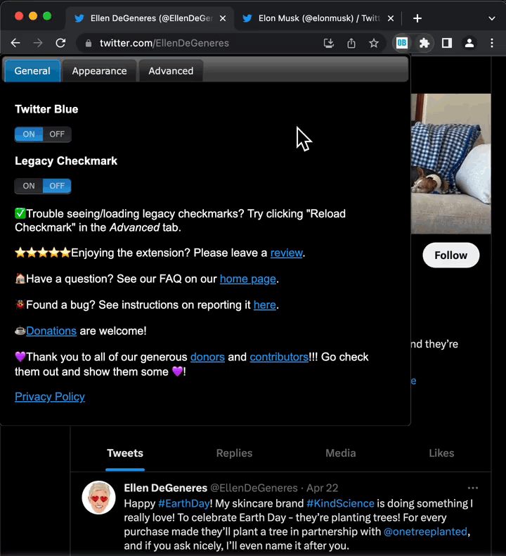

Tired of not knowing who was an Original Bird (**OB**)? Then this extension is for you! A **green checkmark** is added on Twitter to indicate who was an **OB** before the great purge of April 20th, 2023. Don't believe your eyes? Go watch our [YouTube video](https://www.youtube.com/watch?v=dOV4717bG3Y) and read the [FAQ](#faq)!

	
	

<h2 id="features" style="margin: 0;">Features</h2>

<ul style="margin: 0 0 5px 0;">
	<li>Customize checkmark color, or replace with your OWN text / emoji / image!</li>
	<li>Shows checkmarks on embedded Tweets (e.g. on news websites).</li>
	<li>Displays green checkmarks next to legacy verified users.</li>
	<li>Toggle Twitter Blue checkmarks on/off.</li>
</ul>

	
	

## Donations

Thank you to all of our generous [donors](donors.md) and [contributors](contributors.md)! Please go check them out and show them some love!!!

If you like using this extension, then please consider donating to support this project!

**Extension users will see all donor names in light orange and all contributor names in light purple on Twitter.**

## FAQ

	
How do you determine who was legacy verified?

	
Users will see a green checkmark beside OBs who were legacy verified before April 6th, 2023. This means that @verified followed them on Twitter at the time of data collection. We sourced our data from <a target="_blank" rel="noopener noreferrer" href="https://github.com/thansen0/verified_twitters">thansen0</a>. Please show them some love!

	
<b>Note:</b> We are currently only comparing Twitter handles (because it would be costly to verify against the actual Twitter ID). We recognize that Twitter handles may have changed and will be working on it when we have the resources.

	
Why is my browser randomly visiting Elon Musk's Twitter page?

	
This is a normal operation to retrieve Twitter's checkmark that happens once on installation. Since Elon Musk owns Twitter, he is always verified and we obtain Twitter's checkmark from his page after installation. Our extension does not include any Twitter source code or assets to avoid copyright issues.

	
Why do I need to grant permission to access data on Twitter?

	
We access Twitter websites to read user handles in order to check if they are verified and write HTML to add checkmarks. We don't collect any user data. If you are concerned about privacy check out our <a target="_blank" rel="noopener noreferrer" href="https://chromestone.github.io/OriginalBirds/privacy.html">privacy policy</a> or install from our open source <a target="_blank" rel="noopener noreferrer" href="https://github.com/chromestone/OriginalBirds">GitHub repository</a>.

	
Can I be added to the legacy verified list?

	
No. (For legacy verified users, please see below.)

	
As of right now we're only planning on this to be a static list (like a Wayback Machine). If we were to implement our own user verification then it would require volunteers or some external funding, which would 100% draw the ire of Twitter.

	
Of course, you can always donate to us at the link above and get recognition! (Just be sure to give us your Twitter handle.)

	
I'm a legacy verified user and I don't have a green checkmark. Can I be added?

	
<b>Please first read the instructions <a target="_blank" rel="noopener noreferrer" href="https://github.com/chromestone/OriginalBirds/blob/main/CONTRIBUTING.md">here</a>.</b>

	
If you believe you have sufficient proof, then send us an email. Do not create a GitHub issue in this case. For bugs, please see below.

	
I found a bug. How do I report it?

	
<b>Please first read the <a target="_blank" rel="noopener noreferrer" href="https://github.com/chromestone/OriginalBirds/blob/main/CONTRIBUTING.md">contributing guidelines</a>.</b>

	
Twitter can change its website on us anytime so don't hesitate to create an <a target="_blank" rel="noopener noreferrer" href="https://github.com/chromestone/OriginalBirds/issues">issue on GitHub</a> if checkmarks are missing! You can of course reach out to us at our email listed on the Chrome Web Store. However, for sanity purposes we request you stick to GitHub issues.

	
How do I become a contributor?

	
Always consult the <a target="_blank" rel="noopener noreferrer" href="https://github.com/chromestone/OriginalBirds/blob/main/CONTRIBUTING.md">contributing guidelines</a> first and then make a GitHub issue. Remember to include your Twitter handle when you make your pull request. If it gets approved, then congrats, you're a contributor!

	
(Discord for donors and contributors coming soon.)

## Privacy

We take your privacy seriously and **do not** collect **any** user data. We will always be transparent and open source.

For more information please see our [Privacy Policy](privacy.md).
